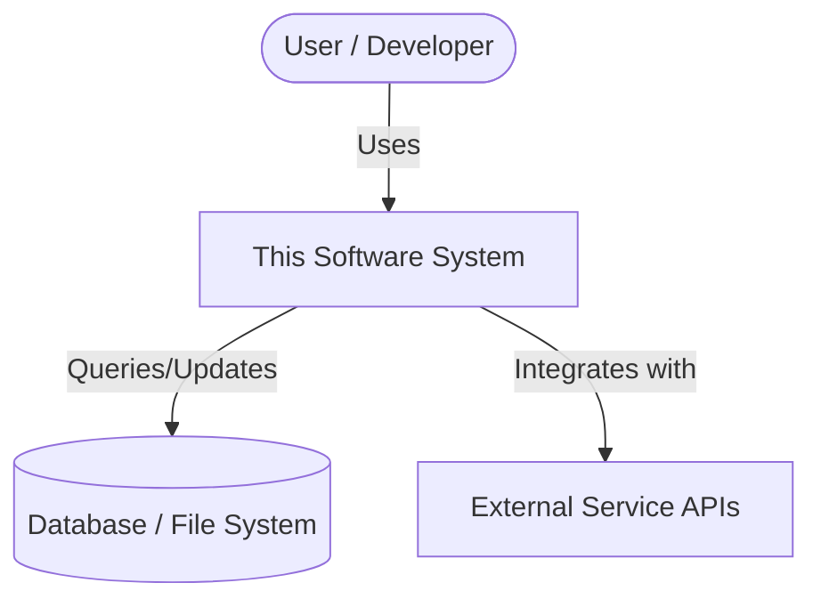
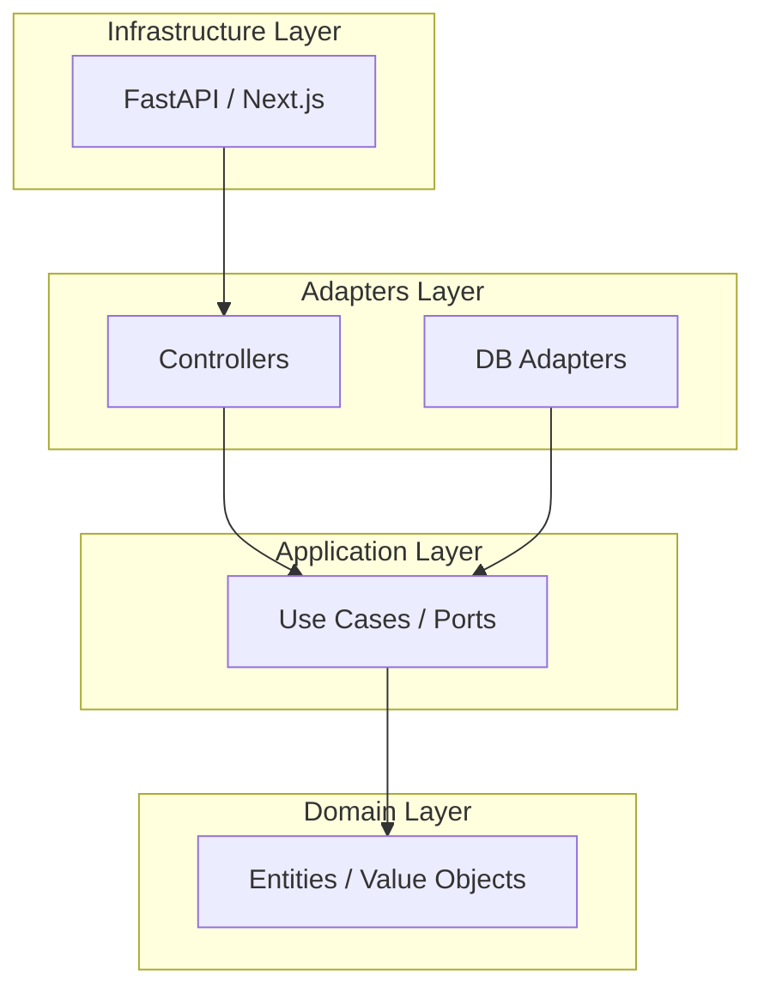
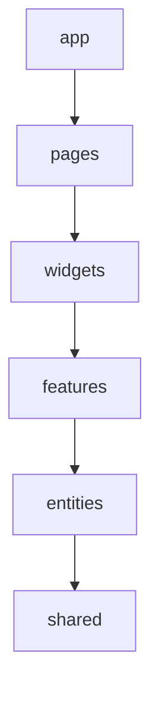
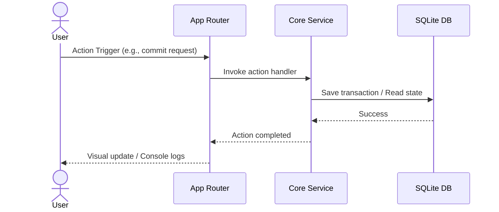

# ARCHITECTURE.md — Project Architecture Blueprint
<!-- Generated by Context OS. Update this file as the project evolves. -->
<!-- The pre-commit hook blocks commits if this file is missing. -->

> [!NOTE]
> This architecture document is compliant with the **arc42** structure (ISO/IEC/IEEE 42010), integrated with the **C4 Model** for visual representation and **Architecture Decision Records (ADRs)** for decision tracking.

---

## 1. Introduction & Goals
High-level overview of the project, why it exists, and the foundational goals driving its development.

### 1.1 Requirements Overview
<!-- 1-2 sentence description of what this project does and why it exists. -->

### 1.2 Foundational Research
<!-- 
Identify at least 4-5 links to external sources (YouTube, technical blogs, documentation, social media) that informed this architecture. Describe what was adapted from each.
-->
- [Source 1](https://example.com/source1): Detail design pattern or implementation approach learned.
- [Source 2](https://example.com/source2): Detail design pattern or implementation approach learned.
- [Source 3](https://example.com/source3): Detail design pattern or implementation approach learned.
- [Source 4](https://example.com/source4): Detail design pattern or implementation approach learned.

### 1.3 Quality Goals
*   **Maintainability:** Small, cohesive files constrained by declarative budget limits.
*   **Predictability:** Fully declarative configuration and deterministic build states.

---

## 2. Architecture Constraints
The technical, organizational, and political limitations bounding the design.

### 2.1 File Size Budgets (Technical Constraint Gate)
Target soft/hard line budgets per file. The pre-commit hook warns (soft) or blocks (hard) based on these constraints to ensure high cohesion.

| Scope / Module | Line Budget (Soft-Hard) | Notes |
|:---|:---|:---|
| Global default | 400-500 | Fallback budget range for untyped files |
| `domain` / `entities` | 150-250 | Strict capsules ensure focused business models |
| `application` / `features` | 250-350 | Mid-range targets for application services & features |
| `adapters` / `widgets` | 350-500 | Interface adapters and composite UI components |
| `infrastructure` / `app` | 500-750 | System configs, server layouts, and bootstrap code |
| Test files | 200-350 | Test suites should be focused and unit-level |
| Config files | No limit | Lock files, generated parameters, and JSON arrays |

---

## 3. Context & Scope
Defines the boundary of the system: what is inside the system, who/what interacts with it from the outside, and the channels of interaction.

### 3.1 Ingress / Egress (External Interfaces)
*   **Ingress (Data In):**
    *   **HTTP API** — `POST /api/v1/...`
    *   **CLI** — `./app command --flag`
*   **Egress (Data Out):**
    *   **Database** — PostgreSQL/SQLite via the storage layer
    *   **External APIs** — List third-party integrations (auth providers, LLM models, etc.)

### 3.2 System Context (C4 Level 1)


---

## 4. Solution Strategy
High-level decisions, design patterns, and paradigms guiding implementation.
*   **Primary Paradigm:** Single-responsibility modules, strict lint rules, and deterministic environments.
*   **Build & Environment System:** Nix flake integration to isolate dependencies.

---

## 5. Building Block View
The static decomposition of the system into modules, components, and code layers.

### 5.1 System Decomposition (C4 Level 2)
Choose **ONE** of the following modular mappings depending on the project domain and delete the others.

#### Option A: Clean / Hexagonal Architecture (Ports & Adapters)
<!-- Recommended for core services, agent harnesses, and command-line interfaces. -->
| Module | Directory | Responsibility |
|:---|:---|:---|
| `domain` | `src/domain/` | Pure business entities, value objects, and validation rules (no external imports) |
| `application` | `src/application/` | System use-cases, workflows, and ingress/egress interface definitions (Ports) |
| `adapters` | `src/adapters/` | DB adapters, client wraps, CLI command runners, and UI controllers implementing Ports |
| `infrastructure` | `src/infrastructure/` | Web server framework (Next.js/FastAPI), external network services, and drivers |



#### Option B: Feature-Sliced Design (FSD)
<!-- Recommended for complex frontends, React/Next.js/Vue web applications. -->
| Layer | Directory | Responsibility |
|:---|:---|:---|
| `app` | `src/app/` | Application initialization, global providers, and top-level styles |
| `pages` | `src/pages/` | Routing entrypoints and page components (views) |
| `widgets` | `src/widgets/` | Composite UI elements combining features and entities (e.g. agent grid panel) |
| `features` | `src/features/` | User actions with business value (e.g., run-diagnostics, theme-swap) |
| `entities` | `src/entities/` | Core business concepts, models, and shared client states (e.g. user, session) |
| `shared` | `src/shared/` | Reusable utilities, basic UI components (button, input), and assets |



#### Option C: Domain-Driven Design (DDD) Bounded Contexts
<!-- Recommended for large-scale enterprise services or multi-subdomain workspaces. -->
| Bounded Context | Directory | Responsibility |
|:---|:---|:---|
| `context1` | `src/context1/` | Encapsulates domain logic, events, and services for subdomain A |
| `context2` | `src/context2/` | Encapsulates domain logic, events, and services for subdomain B |
| `shared` | `src/shared/` | Shared libraries, cross-context interfaces, and common utilities |

### 5.2 Interfaces
Define the public API surface of each module. Only list exported functions, types, and endpoints. Match this section to the option chosen above.

#### [Module / Layer Name 1]
```typescript
// Define public functions, exported types, and endpoints
```

#### [Module / Layer Name 2]
```typescript
// Define public functions, exported types, and endpoints
```

---

## 6. Runtime View
The dynamic behavior and interaction of system parts at execution.

### 6.1 Feature Map
How user-facing features map to components and code entrypoints. Feature IDs (F-0XX) trace to `PRODUCT.md` §2 and `SPEC.md`.

| Feature ID | Feature | Modules Involved | Entry Point | Spec |
|:---|:---|:---|:---|:---|
| F-001 | Feature A | `api`, `core` | `src/api/routes/feature-a.ts` | SPEC.md §F-001 |
| F-002 | Feature B | `core`, `storage` | `src/core/feature-b.ts` | SPEC.md §F-002 |

### 6.2 Key Scenarios
<!-- Example: Request Flow / Agent execution cycle -->


---

## 7. Deployment View
Physical mapping of software components to infrastructure environments.
*   **Default Target:** Built and deployed locally or as a system service.
*   **Environment Manager:** Managed dynamically using **Nix Home-Manager**.

---

## 8. Crosscutting Concepts
System-wide conventions, architectural standards, and patterns.

*   **Error Handling:** Use Result types/options to propagate errors cleanly; avoid unhandled exception throws.
*   **Naming Conventions:** camelCase for functions, PascalCase for classes/types, kebab-case/snake_case for files.
*   **Testing Conventions:** Co-locate unit tests alongside target code (e.g. `foo.ts` and `foo.test.ts`).
*   **Dependency Management:** All runtime dependencies must be declared explicitly in lockfiles and Nix config.

---

## 9. Architectural Decisions (ADRs)
We record all major architectural changes as ADRs in `docs/adr/`.

| ADR ID | Decision Title | Status | Date |
|:---|:---|:---|:---|
| **[ADR-0001](docs/adr/0001-bootstrap.md)** | Bootstrap project structure & configs | Approved | 2026-06-13 |

---

## 10. Quality Requirements
Detailed scenarios checking non-functional quality goals.
*   **Performance:** Git hooks must parse config and count lines in under 150ms.
*   **Portability:** Python and shell scripts must remain compatible across Windows/Linux host systems.

---

## 11. Risks & Technical Debt
Known items to monitor or refactor.
*   **Windows encoding quirks:** Python standard print statements run inside Windows consoles must check encoding modes (`utf-8` vs `cp1252`).

---

## 12. Glossary
*   **ADR:** Architecture Decision Record.
*   **FSD:** Feature-Sliced Design.
*   **DDD:** Domain-Driven Design.
*   **MDC:** Model-Driven Context rules compile formats.

---

## Related Docs

- `PRODUCT.md` — feature inventory, personas, vision
- `SPEC.md` — per-feature behavioral specifications, invariants, scenarios
- `PLAN.md` — roadmap, milestones, active workstreams
- `docs/adr/` — architecture decision records
