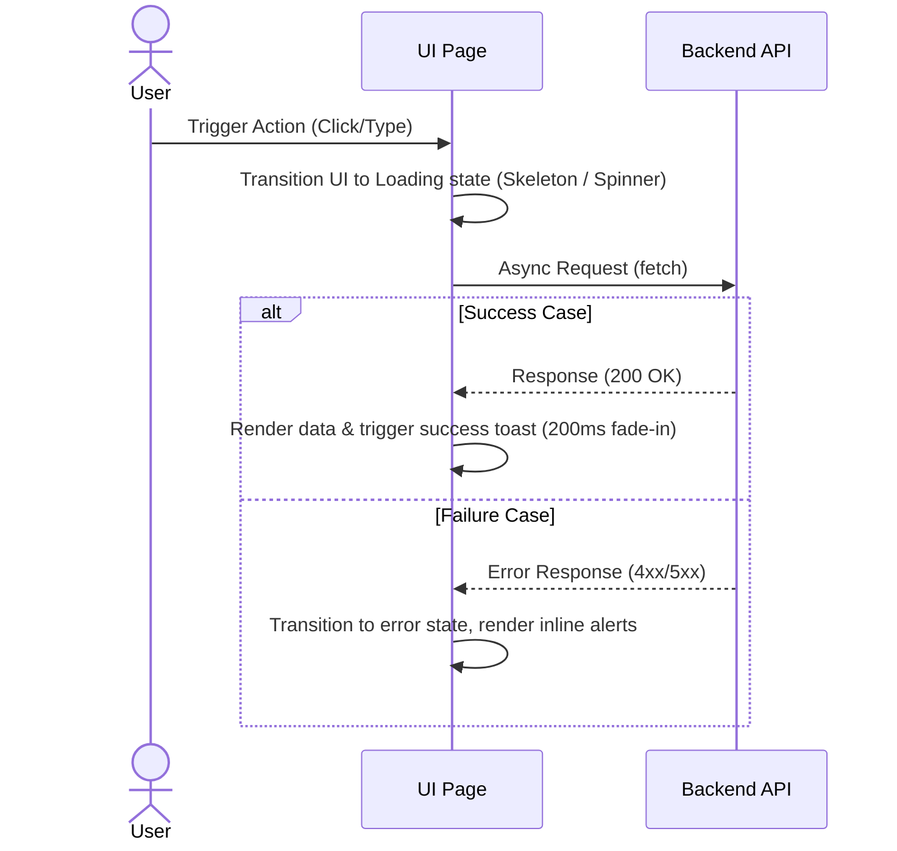

# Design & UI/UX Specifications: [Project Name]

This document details the visual guidelines, design tokens, component hierarchies, user flows, and technical design trade-offs for [Project Name].

---

## 1. Meta-Information & Governance
*   **Status**: [Draft | In Review | Approved | Implemented]
*   **Authors / Maintainers**: [Names/Emails]
*   **Stakeholders**: [UX Designer, Tech Lead, Product Manager]
*   **Last Updated**: [YYYY-MM-DD]

---

## 2. Overview, Scope & Goals

### Context & Purpose
[A brief description of what this UI/UX solves and who the primary users are.]

### Goals (Quantifiable)
*   **Performance**: e.g., First Contentful Paint (FCP) < 1.2s, Bundle size < 150KB.
*   **Accessibility**: e.g., WCAG 2.2 AA Compliance, 100% keyboard navigable.
*   **Visual Fidelity**: e.g., Seamless transitions under 200ms, responsive down to 320px width.

### Non-Goals (Out of Scope)
*   [e.g., Supporting dark mode toggles if the theme is strictly dark.]
*   [e.g., Implementing custom form elements where native HTML components are sufficient.]
*   [e.g., Supporting legacy browsers (like Internet Explorer 11).]

### Alternatives Considered & Trade-offs
*   **Alternative A**: [Alternative layout/architecture]
    *   *Why rejected*: [Trade-offs such as complexity, performance, styling inconsistency]
*   **Alternative B**: [Alternative technology choice, e.g. Tailwind vs Vanilla CSS]
    *   *Why rejected*: [Trade-offs]

---

## 3. Design System & Visual Tokens

### Color Palette (HSL/OKLCH Standard)
All colors must be specified in HSL or OKLCH to allow seamless opacity modifications and systematic color scaling. OKLCH is highly recommended for modern web apps because it is **perceptually uniform** (shifting hue preserves consistent perceived brightness, preventing "muddy" or unreadable contrast shifts).

| Token | HSL / OKLCH Value | Usage | Example (Hex equivalence) |
| :--- | :--- | :--- | :--- |
| `--color-primary` | `oklch(L C H)` or `hsl(h, s%, l%)` | Primary interactive elements, main accents | `#xxxxxx` |
| `--color-secondary` | `oklch(L C H)` or `hsl(h, s%, l%)` | Secondary buttons, borders, highlights | `#xxxxxx` |
| `--color-bg-base` | `oklch(L C H)` or `hsl(h, s%, l%)` | App background (Prefer tinted neutrals over pure black) | `#xxxxxx` |
| `--color-bg-surface` | `oklch(L C H)` or `hsl(h, s%, l%)` | Cards, modals, panels | `#xxxxxx` |
| `--color-text-main` | `oklch(L C H)` or `hsl(h, s%, l%)` | High-contrast body text, headings | `#xxxxxx` |
| `--color-text-muted` | `oklch(L C H)` or `hsl(h, s%, l%)` | Captions, secondary labels, placeholders | `#xxxxxx` |
| `--color-success` | `oklch(L C H)` or `hsl(h, s%, l%)` | Success alerts, validations, positive states | `#xxxxxx` |
| `--color-error` | `oklch(L C H)` or `hsl(h, s%, l%)` | Validation errors, destructive actions, alerts | `#xxxxxx` |

```css
/* Boilerplate: Copy directly into index.css / variables.css */
:root {
  /* OKLCH Pattern (Preferred: Perceptually uniform, avoids AI-default saturated slop) */
  --color-primary-l: 0.6;
  --color-primary-c: 0.15;
  --color-primary-h: 250;
  --color-primary: oklch(var(--color-primary-l) var(--color-primary-c) var(--color-primary-h));

  --color-secondary-l: 0.45;
  --color-secondary-c: 0.1;
  --color-secondary-h: 180;
  --color-secondary: oklch(var(--color-secondary-l) var(--color-secondary-c) var(--color-secondary-h));

  /* Procedural & Derived Tokens (Design Book Philosophy: Rules/formulas over static values) */
  /* Hover and active states generated procedurally by shifting lightness in OKLCH */
  --color-primary-hover: oklch(calc(var(--color-primary-l) - 0.07) var(--color-primary-c) var(--color-primary-h));
  --color-primary-active: oklch(calc(var(--color-primary-l) - 0.12) var(--color-primary-c) var(--color-primary-h));

  /* Tinted Neutrals generated procedurally (mixes base neutral with 8% of the brand primary) */
  --color-bg-base-raw: oklch(0.12 0 0); /* Pure black/gray base */
  --color-bg-base: color-mix(in oklch, var(--color-primary) 8%, var(--color-bg-base-raw));
  --color-bg-surface: color-mix(in oklch, var(--color-primary) 15%, var(--color-bg-base-raw));

  --color-text-main: oklch(0.95 0.005 250);
  --color-text-muted: oklch(0.75 0.01 250);

  --color-success: oklch(0.65 0.17 140);
  --color-error: oklch(0.62 0.22 25);

  /* Alternative HSL Pattern (If OKLCH is not desired) */
  /*
  --color-primary-h: 0;
  --color-primary-s: 0%;
  --color-primary-l: 0%;
  --color-primary: hsl(var(--color-primary-h), var(--color-primary-s), var(--color-primary-l));
  */

  /* Spacing Scale (Base 8px) */
  --space-xs: 4px;
  --space-sm: 8px;
  --space-md: 16px;
  --space-lg: 24px;
  --space-xl: 32px;
  --space-xxl: 48px;

  /* Borders & Shadows */
  --radius-btn: 4px;
  --radius-card: 8px;
  --radius-modal: 16px;

  --shadow-sm: 0 1px 2px 0 rgba(0, 0, 0, 0.05);
  --shadow-md: 0 4px 6px -1px rgba(0, 0, 0, 0.1), 0 2px 4px -1px rgba(0, 0, 0, 0.06);

  /* Transitions */
  --transition-fast: 150ms ease-in-out;
  --transition-normal: 250ms ease-in-out;
}
```

### Typography (Google Fonts / System Fallbacks)
*   **Headings**: `[Font Name]` (Weights: `400`, `700`) - Fallback: `system-ui, sans-serif`
*   **Body Text**: `[Font Name]` (Weights: `400`, `500`) - Fallback: `sans-serif`
*   **Code/Monospace**: `[Font Name]` (Weights: `400`) - Fallback: `monospace`

### Spacing & Grid System
*   **Base Unit**: `8px`
*   **Scale**: `4px` (xs) | `8px` (sm) | `16px` (md) | `24px` (lg) | `32px` (xl) | `48px` (xxl)
*   **Responsive Breakpoints**:
    *   *Mobile*: `< 600px` (4-column grid, 16px margins)
    *   *Tablet*: `600px - 1024px` (8-column grid, 24px margins)
    *   *Desktop*: `> 1024px` (12-column grid, 32px margins, max-width 1200px)

### Visual Effects (Borders & Shadows)
*   **Border Radius**: `4px` (buttons/inputs) | `8px` (cards) | `16px` (modals)
*   **Shadows**:
    *   `--shadow-sm`: `0 1px 2px 0 rgba(0, 0, 0, 0.05)`
    *   `--shadow-md`: `0 4px 6px -1px rgba(0, 0, 0, 0.1), 0 2px 4px -1px rgba(0, 0, 0, 0.06)`

---

## 4. Reusable Component Hierarchy & Interactive States

Every component must define styling tokens and behaviors for all applicable states.

### [Component 1 Name] (e.g. Primary Button)
*   **Description**: [Single-responsibility statement]
*   **DOM Structure**: `button.btn-primary`
*   **State Matrix**:
    *   *Default (Idle)*: Background `--color-primary`, text `--color-bg-base`, outline `none`.
    *   *Hover*: Shift lightness `-5%` (e.g. `hsl(h, s%, l - 5%)`), add transition `150ms ease-in-out`.
    *   *Active/Pressed*: Shift lightness `-10%`, transform scale `0.98`.
    *   *Focus*: Add outline ring `2px solid --color-secondary` with `2px` offset (Mandatory for A11y).
    *   *Disabled*: Opacity `0.5`, `cursor: not-allowed`, pointer-events `none`.
    *   *Loading*: Show inline spinner or replace text with text `--color-text-muted` and pulse animation.

---

## 5. Cross-Cutting Concerns

### Accessibility (A11y)
*   **Keyboard Navigation**: Define TabIndex progression (e.g., Left/Right arrows navigate tabs, Escape closes modal).
*   **ARIA Roles**: Explicitly define roles (e.g., `role="dialog"`, `aria-modal="true"`, `aria-describedby="..."`).
*   **Color Contrast**: Maintain a minimum contrast ratio of `4.5:1` for normal text and `3:1` for large text.

### Performance & Asset Optimization
*   **Images**: All images must use modern formats (WebP/AVIF) and include explicit `width` and `height` attributes to prevent layout shifts (CLS).
*   **Animations**: Limit CSS transitions to hardware-accelerated properties (`transform`, `opacity`). Never transition layout properties (`width`, `height`, `margin`, `top`) as they trigger browser reflows.

### Internationalization (i18n) / Localization
*   **Text Scaling**: Containers must allow text expansion of at least 30% without clipping or breaking the layout structure.

---

## 6. Input Validation & Edge States

### Form Validation Rules
*   **Email Field**: Format checks via standard regex; validates on blur.
*   **Password Field**: Enforce minimum character requirements; updates strength bar in real-time.

### Inline Alerts & Feedback
*   Error alerts must appear directly beneath the invalid input, associated with `aria-live="polite"` and `aria-invalid="true"`.

### Empty States & Loading States
*   **Empty State**: When no items exist, render a descriptive message and a primary action button (e.g. "Create New").
*   **Skeleton States**: Render content skeleton cards during first load instead of a blank page or blocking full-screen loaders.

---

## 7. User Interaction Flows

Step-by-step navigation paths for user interactions.



---

## 8. UI Mockups & Prompts Log

History of mockups generated via text-to-image or captured via testing tools.

*   **Mockup 1 (Desktop Dashboard)**: ``
    *   *Prompt used*: "Clean modern SaaS dashboard, dark mode, violet accents, flat minimalist vector art, UI design mockup"
     *   *Status / Verified*: Verified against standard.

---

## Related Docs

- `ARCHITECTURE.md` — system decomposition, component trees
- `PRODUCT.md` — brand voice, user journeys
- `TESTING.md` — visual regression testing
- `docs/adr/` — architecture decision records
